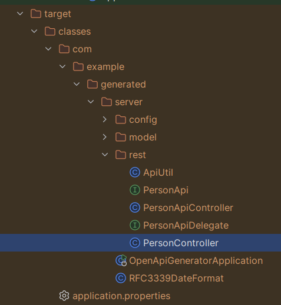
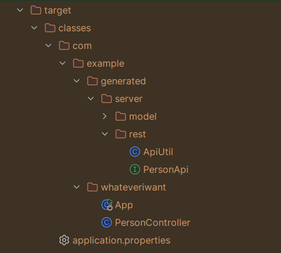

# OpenAPI Generator Demo
- used generator: https://openapi-generator.tech/
- API first approach
- From the `openapi.yaml` generated both server and client

## Delegate with implementation
The corresponding part of the `pom.xml` is:
```xml
<configuration>
    <inputSpec>${project.basedir}/openapi.yaml</inputSpec>
    <generatorName>spring</generatorName>

    <apiPackage>${openapi-base-package}.rest</apiPackage>
    <modelPackage>${openapi-base-package}.model</modelPackage>
    <configOptions>
        <basePackage>${openapi-base-package}</basePackage>
        <configPackage>${openapi-base-package}.config</configPackage>
        <useSpringBoot3>true</useSpringBoot3>
        <useTags>true</useTags>
        <delegatePattern>true</delegatePattern>
    </configOptions>
</configuration>
```
and the target looks like this:



**Note:** Our controller which implements `PersonApiDelegate` has to be in some subpackage of the base package where are
the generated server stuff, in this case, `com.example.generated.server`. The reason in doing so is that otherwise, our
controller wouldn't be in the application context (since `OpenApiGeneratorApplication` is the class which has
`@ComponentScan`), which would result, among others, in 501 Not implemented exceptions.

## Interface-only approach
The corresponding part of the `pom.xml` is:
```xml
 <configuration>
    <inputSpec>${project.basedir}/openapi.yaml</inputSpec>
    <generatorName>spring</generatorName>

    <apiPackage>${openapi-base-package}.rest</apiPackage>
    <modelPackage>${openapi-base-package}.model</modelPackage>
    <configOptions>
        <basePackage>${openapi-base-package}</basePackage>
        <configPackage>${openapi-base-package}.config</configPackage>
        <useSpringBoot3>true</useSpringBoot3>
        <useTags>true</useTags>
        <interfaceOnly>true</interfaceOnly>
    </configOptions>
</configuration>
```
and the target looks like this:



**Note 1:** The name of our package under the `/src` is absolutely independent from the package name of the generated
server stuff, e.g. `com.example.whateveriwant` vs `com.example.generated.server`.

**Note 2:** Since we do not have any implementation generated here, we need to add with the `main` method ourselves,
e.g. `App.java`.
